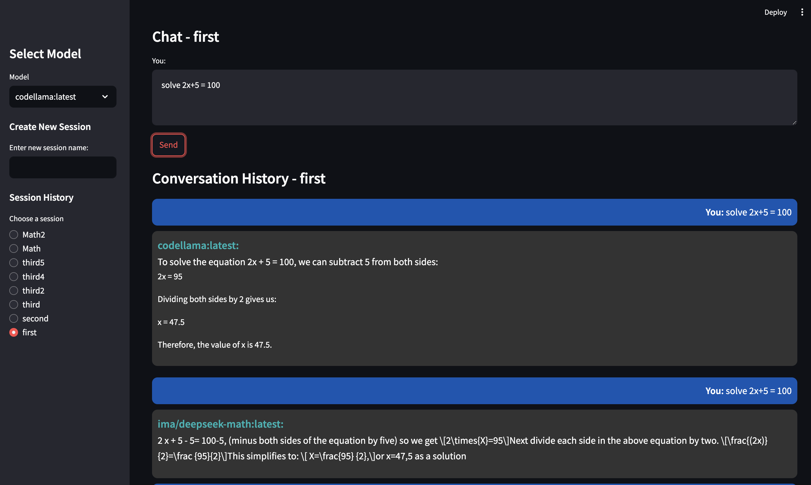

# Ollama Python Client


## Overview
Ollama Python Client is a Streamlit-based web application that allows users to interact with multiple AI models using a chatbot interface. The application supports multiple sessions, and each session maintains its own conversation history. All conversations are saved in a SQLite database, enabling users to review and manage past interactions.

## Key Advantages
1. **List All Installed Models**: The application lists all AI models installed through Ollama, providing easy access to all available models.
2. **Multiple Models in a Single Conversation**: Users can interact with more than one model in the same conversation, allowing for a flexible and dynamic chatbot experience.
3. **Persistent Conversations**: Every conversation is saved in a SQLite database, making it easy to view, manage, and retrieve conversation histories at any time.

## Requirements
- Python 3.7+
- Streamlit
- Gradio
- Requests
- Ollama installed and running (accessible via the command line)

## Installation

1. **Clone the Repository**:
    ```bash
    git clone https://github.com/ayman3000/ollama-client.git
    cd ollama-client
    ```

2. **Create a Virtual Environment** (optional but recommended):
    ```bash
    python -m venv venv
    source venv/bin/activate  # On Windows use `venv\Scripts\activate`
    ```

3. **Install the Required Packages**:
    ```bash
    pip install streamlit gradio requests sqlite3 
    ```

4. **Ensure Ollama is Running**:
    Make sure Ollama is installed and accessible via the command line.

## Running the Application
To start the Streamlit app, run the following command:
```bash
streamlit run ollama_client.py
```
This will open the application in your default web browser.

## Usage

1. **Select an AI Model**: In the sidebar, select a model from the list of available models fetched from Ollama.
2. **Create a New Session**: Provide a name for a new chat session and press Enter to create the session immediately.
3. **Interact with Multiple Models**: You can input text and choose different models within the same conversation to get varied responses from each one.
4. **View Conversation History**: You can view and manage past conversations in the "Conversation History" section.

## Database Schema
- **Session Table**: Stores session details (session ID, name, timestamp).
- **Conversations Table**: Stores conversation details for each session (session ID, model name, user input, bot response, timestamp).

## Project Structure
- `ollama_client.py`: Main application file containing the Streamlit interface and functionality.
- `chat_history.db`: SQLite database file storing the session and conversation data.

## Known Issues
- Ensure Ollama is installed and running correctly; otherwise, model information may not be retrieved successfully.
- Only local instances of Ollama are supported.

## Contributing
Feel free to open issues or submit pull requests. Contributions are welcome!

## License
This project is licensed under the MIT License.

## Acknowledgements
- **Streamlit**: For providing an easy and interactive way to build data applications.
- **Ollama**: For powering the model backend and providing AI model services.

## Contact
For questions or feedback, please open an issue in the repository or contact `ayman3000@gmail.com`.

